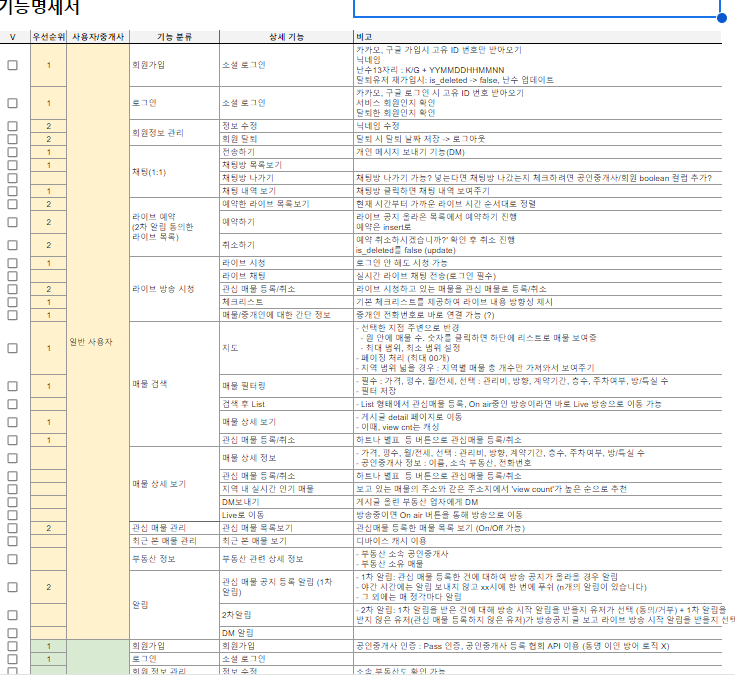
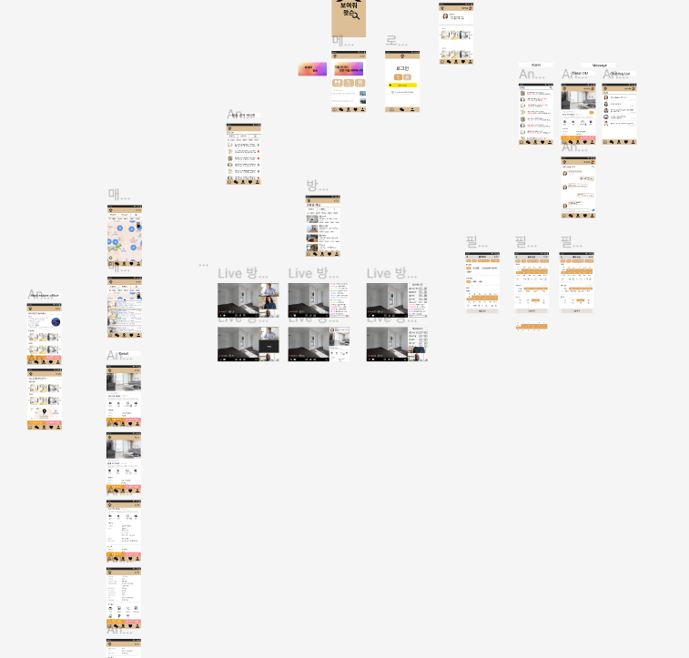
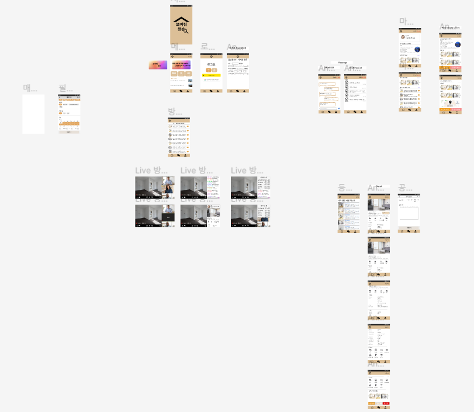
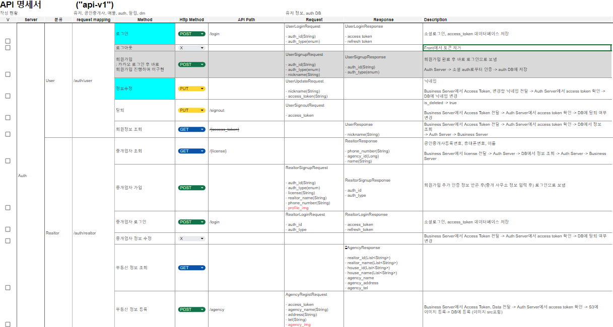

# 사장님! 7인분 같은 6인분 주세요

## 사전 개발 작업

### 공통
    - 서비스 아이콘 제작
    - 기술 스택 선정
    - 정보구조도 

### Backend
- ERD 제작  

- 아키텍쳐

- 기능명세서

- sequence diagram

### Frontend

- MVP 제작
    - Figma MVP 제작
        - MVP (Flutter) 초안 미완성
            - filter
            - 매물 등록 페이지(agent)
            - Like
            - MyPage
            - user
            - agent
            - Live Page
            - Live Page map
            - direct distance
            - Map
            - Index
            - SignUp
            - social login
            - SignIn(우선적 회원가입 위주)
            - social login
            - Licenses
            - payment
            - Details
                - 전화, 메세지 연결하기
                - 구매 정보
                - 방 정보
                - 추가 옵션
            - Chatting
            - DM
            - 알림창
            - 공인중개사 사무소 페이지
            - 공인중개사 등록 매물 페이지
            - live 일정 공지 창
            - 게시판 형식?
            - splash

## 개발 시작 및 진행 중

### Frontend

- Flutter MVP 제작
    - detail Page
        - 전화 연결
        - 구매정보
        - 방정보
        - 추가 옵션
        - carousel
    - filter
        - list
    - appbar
    - splash
    - navbar
    - router
    - 카카오 소셜 로그인(front)

### Backend

- CI/CD
- Docker를 사용한 배포 및 스크립트 파일 작성
- 카카오 소셜 로그인 및 회원가입(back)
- 라이브공지 CRUD
- 매물관리 CRUD
- Openvidu(Java) 구현
- 알림(1차, 2차, DM)
- Kafka를 통한 FCM 알림메시지 및 리스트 통신
- S3를 통한 매물 사진 관리
