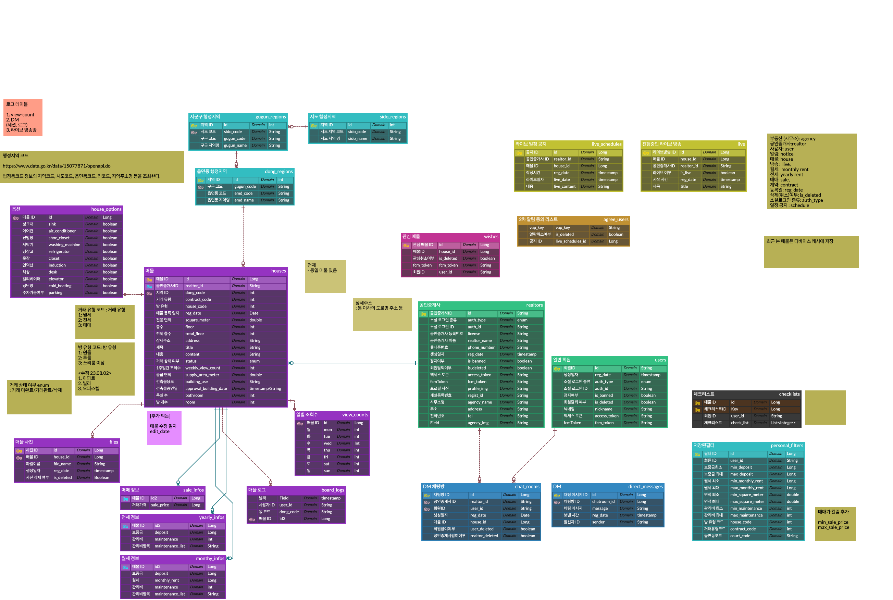

# 보여줘 왓슨

### 개발기간  
2023.07.04 - 2023.08.18
### 주제
매물 실시간 방송 서비스 제공 어플

#### 사용 기술 스택

 

 

 

 
 

 

 

 

 

 

 

 

### 발표자료
[ppt](docs/presentation/공통PJT_서울_8반_A803_허주혁.pdf)

 
[발표영상](docs/presentation/공통PJT_서울_8반_A803_UCC경진대회.mp4)

## 역할

### 프론트
##### 류정모
    - Figma 제작 
    - DM 
    - chatting 일반 유저 페이지 
    - 구글 맵을 통한 매물 정보 제공
    -  매물 관련 정보 필터
##### 허주혁
    - Figma 제작 
    - 로그인 페이지 (중개사, 일반 유저)
    - 매물 작성 페이지
    - 라이브 등록, 목록
    - 스케줄 등록, 목록

 

### 백엔드
##### 김기헌
    - 아키텍쳐 , 시퀀스 설계
    - 배포 스크립트 작성 
    - 로그 저장, 분석
    - 지역별 주간 랭킹 선정
    - 깃 관리 
    - 코드 리팩토링
##### 박지영
    - Kafka와 FCM을 이용한 Notice 서버 개발
    - Openvidu 서버 구축
    - Redis 서버 구축
    - S3이미지 서버 구축
##### 오채영
    - 매물 CRUD 
    - 매물 필터링 
    - 관심매물 CRUD 
    - 방송 스케줄 게시판 CRUD
##### 이정민
    - 사용자/중개사 정보 CRUD
    - JWT 토큰을 이용한 로그인 및 인가
    - Spring Security

 
 

----

## 정보구조도 

## Frontend
[figma](https://www.figma.com/file/SOoHTxgMwKQqBppPFFAvHY/%EB%B6%80%EB%8F%99%EC%82%B0-%EC%A4%91%EA%B0%9C-%ED%99%94%EC%83%81-%ED%94%8C%EB%9E%AB%ED%8F%BC-%EC%95%B1-MVP-(1%EC%B0%A8-%EC%99%84%EC%84%B1%EB%B3%B8)-(Copy)?type=design&node-id=111%3A2&mode=design&t=ZmTgbWDQAYHdGAx7-1)

##### 사용자

##### 중개자

## Backend
#### ERD 제작  

#### 아키텍쳐

#### 명세서
[기능명세서/API명세서](https://docs.google.com/spreadsheets/d/1O8tJik-yb2d7x9Nqm7bvH7MYdZcXFeiq4Sb5f2xZhYU/edit?usp=sharing)

#### Swagger
[auth](http://i9a803.p.ssafy.io:8080/swagger-ui/index.html)

[business](http://i9a803.p.ssafy.io:8081/swagger-ui/index.html)

[notice](http://i9a803.p.ssafy.io:8082/swagger-ui/index.html)

-----

<!-- - MVP 제작
    - Figma MVP 제작
        - MVP (Flutter) 초안 미완성
            - filter
            - 매물 등록 페이지(agent)
            - Like
            - MyPage
            - user
            - agent
            - Live Page
            - Live Page map
            - direct distance
            - Map
            - Index
            - SignUp
            - social login
            - SignIn(우선적 회원가입 위주)
            - social login
            - Licenses
            - payment
            - Details
                - 전화, 메세지 연결하기
                - 구매 정보
                - 방 정보
                - 추가 옵션
            - Chatting
            - DM
            - 알림창
            - 공인중개사 사무소 페이지
            - 공인중개사 등록 매물 페이지
            - live 일정 공지 창
            - 게시판 형식?
            - splash -->

<!-- ## 개발 시작 및 진행 중 -->

<!-- ### Frontend

- Flutter MVP 제작
    - detail Page
        - 전화 연결
        - 구매정보
        - 방정보
        - 추가 옵션
        - carousel
    - filter
        - list
    - appbar
    - splash
    - navbar
    - router
    - 카카오 소셜 로그인(front)

### Backend

auth swagger(추후 외부 포트 닫을 예정)
http://i9a803.p.ssafy.io:8080/swagger-ui/index.html

business swagger
http://i9a803.p.ssafy.io:8081/swagger-ui/index.html

notice swagger
http://i9a803.p.ssafy.io:8082/swagger-ui/index.html -->

