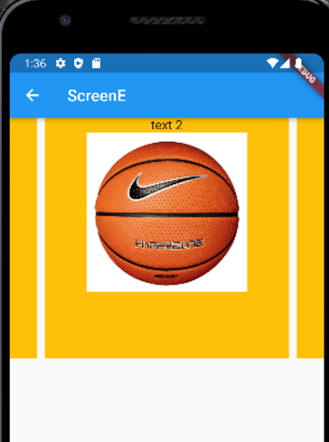

# Carousel slider

- 공식 홈페이지
    - https://pub.dev/packages/carousel_slider
    - 다양한 carousel도 있으니 참고
        - [Search results for carousel (pub.dev)](https://pub.dev/packages?q=carousel)
    
- pubspec.yaml에 carousel_slider:^4.0.0을 추가합니다.

```dart
dependencies:
  flutter:
    sdk: flutter
  fluttertoast: ^8.0.8

  carousel_slider: ^4.2.1
```

- route 중 한 페이지에 만들어보았다.

```dart
import 'package:flutter/material.dart';
import 'package:carousel_slider/carousel_slider.dart';

class ScreenE extends StatelessWidget {

  @override
  Widget build(BuildContext context) {
    return Scaffold(
      appBar: AppBar(
        title: Text('ScreenE'),

      ),
      body:
      CarouselSlider(
        options: CarouselOptions(height: 300.0),
        items: [1,2,3,4,5].map((i) {
          return Builder(
            builder: (BuildContext context) {
              return Container(
                  width: MediaQuery.of(context).size.width,
                  margin: EdgeInsets.symmetric(horizontal: 5.0),
                  decoration: BoxDecoration(

                      color: Colors.amber
                  ),
                  child: Column(
                    children: [
                      Text(
                        'text $i',
                        style: TextStyle(fontSize: 16.0),
                      ),
                      Image.asset(
                        'assets/ball.png',
                        width:200,
                        fit : BoxFit.contain,
                      ),
                  ],
                  ),
              );
            },
          );
        }).toList(),
      ),
    );
  }
}

```
- 공식 홈페이지
    - https://pub.dev/packages/carousel_slider
    - 다양한 carousel도 있으니 참고
        - [Search results for carousel (pub.dev)](https://pub.dev/packages?q=carousel)
    
- pubspec.yaml에 carousel_slider:^4.0.0을 추가합니다.

```dart
dependencies:
  flutter:
    sdk: flutter
  fluttertoast: ^8.0.8

  carousel_slider: ^4.2.1
```

- route 중 한 페이지에 만들어보았다.

```dart
import 'package:flutter/material.dart';
import 'package:carousel_slider/carousel_slider.dart';

class ScreenE extends StatelessWidget {

  @override
  Widget build(BuildContext context) {
    return Scaffold(
      appBar: AppBar(
        title: Text('ScreenE'),

      ),
      body:
      CarouselSlider(
        options: CarouselOptions(height: 300.0),
        items: [1,2,3,4,5].map((i) {
          return Builder(
            builder: (BuildContext context) {
              return Container(
                  width: MediaQuery.of(context).size.width,
                  margin: EdgeInsets.symmetric(horizontal: 5.0),
                  decoration: BoxDecoration(

                      color: Colors.amber
                  ),
                  child: Column(
                    children: [
                      Text(
                        'text $i',
                        style: TextStyle(fontSize: 16.0),
                      ),
                      Image.asset(
                        'assets/ball.png',
                        width:200,
                        fit : BoxFit.contain,
                      ),
                  ],
                  ),
              );
            },
          );
        }).toList(),
      ),
    );
  }
}

```

