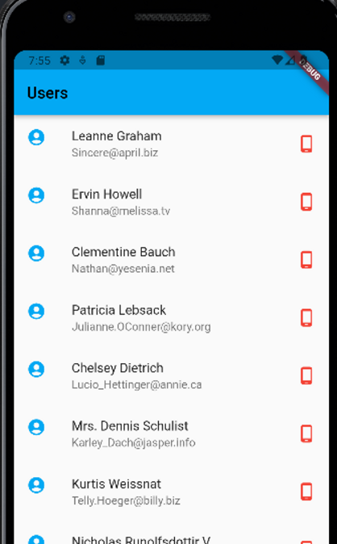

# Json File list

- Json 데이터:
    - [https://jsonplaceholder.typicode.com/](https://www.youtube.com/redirect?event=video_description&redir_token=QUFFLUhqbFZPWjVNWHY3WlVXWXVNTXZXZ0pBZFJGWGwzQXxBQ3Jtc0tuWnluWVVzcGlpV0ludlhkTGtXTzZ5cTU2MHIzYlljY3ZDcXo1NzdQcjZvZlJ3M3FzQXE2WDVwM2xBVUF5MUZKOERxNzNpS19QbUFkVFNKMFZoTllNTHgwRXliODcxX3hrRndGM2dpN2dvWmphVTBnUQ&q=https%3A%2F%2Fjsonplaceholder.typicode.com%2F&v=bQN8LP3CR20)
- QuickType 사이트:
    - [https://app.quicktype.io/](https://www.youtube.com/redirect?event=video_description&redir_token=QUFFLUhqbVJiTnI3VEFPdWlCdGxleVZTR2xPMV9xUlhpUXxBQ3Jtc0tudlRLVC1xc3BTV2xlM1pEZnJyM00xVEVQU2pfT0h0LWxrU3BmcTlTTVd5SGpEcU1GTzFBVXhENnNVNUYwNlpTUUtkT2lwSC1BUzlNVE9BTF9ZeFhNT0xLdTJBOWFrUXEzU0p1SlhRbk9WZ0FnclR6Zw&q=https%3A%2F%2Fapp.quicktype.io%2F&v=bQN8LP3CR20)

- main.dart

```dart
import 'package:flutter/material.dart';
import 'json_parse.dart';

void main() => runApp(MyApp());

class MyApp extends StatefulWidget {
  @override
  State<StatefulWidget> createState() => _MyAppState();
}

class _MyAppState extends State<MyApp> {
  @override
  Widget build(BuildContext context) {
    return MaterialApp(
      theme: ThemeData(
        primarySwatch: Colors.lightBlue
      ),
      home: JsonParse(),
    );
  }
}

```

- sevice.dart

```dart
import 'package:http/http.dart' as http;
import 'dart:convert';
import 'package:fluttertoast/fluttertoast.dart';
import 'user.dart';

class Services {
  static const String url = 'https://jsonplaceholder.typicode.com/users';

  static Future<List<User>> getInfo() async{
    try {
      final response = await http.get(Uri.parse(url));
      if (response.statusCode == 200){
        final List<User> user = userFromJson(response.body);
        return user;
      }else{
        Fluttertoast.showToast(msg: 'Error occured. Please try againn');
        return <User>[];
      }
    }catch(e){
      Fluttertoast.showToast(msg: e.toString());
      return <User>[];

    }

  }

}
```

- user.dart

```dart
import 'dart:convert';

List<User> userFromJson(String str) => List<User>.from(json.decode(str).map((x) => User.fromJson(x)));

String userToJson(List<User> data) => json.encode(List<dynamic>.from(data.map((x) => x.toJson())));

class User {
  int id;
  String name;
  String username;
  String email;
  Address address;
  String phone;
  String website;
  Company company;

  User({
    required this.id,
    required this.name,
    required this.username,
    required this.email,
    required this.address,
    required this.phone,
    required this.website,
    required this.company,
  });

  factory User.fromJson(Map<String, dynamic> json) => User(
    id: json["id"],
    name: json["name"],
    username: json["username"],
    email: json["email"],
    address: Address.fromJson(json["address"]),
    phone: json["phone"],
    website: json["website"],
    company: Company.fromJson(json["company"]),
  );

  Map<String, dynamic> toJson() => {
    "id": id,
    "name": name,
    "username": username,
    "email": email,
    "address": address.toJson(),
    "phone": phone,
    "website": website,
    "company": company.toJson(),
  };
}

class Address {
  String street;
  String suite;
  String city;
  String zipcode;
  Geo geo;

  Address({
    required this.street,
    required this.suite,
    required this.city,
    required this.zipcode,
    required this.geo,
  });

  factory Address.fromJson(Map<String, dynamic> json) => Address(
    street: json["street"],
    suite: json["suite"],
    city: json["city"],
    zipcode: json["zipcode"],
    geo: Geo.fromJson(json["geo"]),
  );

  Map<String, dynamic> toJson() => {
    "street": street,
    "suite": suite,
    "city": city,
    "zipcode": zipcode,
    "geo": geo.toJson(),
  };
}

class Geo {
  String lat;
  String lng;

  Geo({
    required this.lat,
    required this.lng,
  });

  factory Geo.fromJson(Map<String, dynamic> json) => Geo(
    lat: json["lat"],
    lng: json["lng"],
  );

  Map<String, dynamic> toJson() => {
    "lat": lat,
    "lng": lng,
  };
}

class Company {
  String name;
  String catchPhrase;
  String bs;

  Company({
    required this.name,
    required this.catchPhrase,
    required this.bs,
  });

  factory Company.fromJson(Map<String, dynamic> json) => Company(
    name: json["name"],
    catchPhrase: json["catchPhrase"],
    bs: json["bs"],
  );

  Map<String, dynamic> toJson() => {
    "name": name,
    "catchPhrase": catchPhrase,
    "bs": bs,
  };
}

```

- json_parse.dart

```dart
import 'package:flutter/material.dart';
import 'package:flutter_prac1/user.dart';
import 'service.dart';

class JsonParse extends StatefulWidget {
  @override
  _JsonParseState createState() => _JsonParseState();
}

class _JsonParseState extends State<JsonParse> {
  List<User> users = <User>[];
  bool loading = false;

  @override
  void initState() {
    super.initState();
    Services.getInfo().then((value) {
      setState(() {
        users = value;
        loading = true;
      });
    });
  }

  @override
  Widget build(BuildContext context) {
    return Scaffold(
      appBar: AppBar(
        title: Text(loading ? 'Users' : 'Loading...'),
      ),
      body: ListView.builder(
        itemCount: users.length,
        itemBuilder: (context, index) {
          User user = users[index];
          return ListTile(
            leading: const Icon(
              Icons.account_circle_rounded,
              color: Colors.lightBlue,
            ),
            trailing: const Icon(
              Icons.phone_android_outlined,
              color: Colors.red,
            ),
            title: Text(user.name),
            subtitle: Text(user.email),
          );
        },
      ),
    );
  }
}

```

