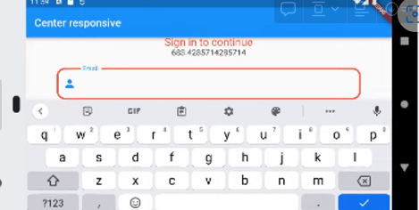

# responsive scroll

- lib/prac3

```dart
import 'package:flutter/material.dart';
import 'package:prac2/responsive/breakpoint.dart';
import 'package:prac2/responsive/responsive_center.dart';
import 'package:prac2/signin.dart';

class prac3 extends StatelessWidget {
  const prac3({Key? key});

  @override
  Widget build(BuildContext context) {
    return Scaffold(
      appBar: AppBar(
        title: Text('enter responsive'),
      ),
      body: SingleChildScrollView(
        child: ResponsiveCenter(
          child: const Signin(),
          maxContentWidth: BreakPoint.tablet,
          padding: EdgeInsets.all(16),
        ),
      ),
    );
  }
}
```

- lib/signin

```dart
import 'package:flutter/material.dart';

class Signin extends StatefulWidget {
  const Signin({super.key});

  @override
  State<Signin> createState() => _SigninState();
}

class _SigninState extends State<Signin> {
  @override
  Widget build(BuildContext context) {
    final double currentWidth = MediaQuery.of(context).size.width;
    return Center(
      child: Column(
        children: [
          const Text(
            'Sign in to continue',
            style: TextStyle(
              fontSize: 20,
              color: Colors.red,
            ),
          ),
          Text(
            currentWidth.toString(),
            style: const TextStyle(fontSize: 15),
          ),
          const SizedBox(
            height: 20,
          ),
          TextField(
            decoration: InputDecoration(
              prefixIcon: const Icon(Icons.person),
              labelText: 'Email',
              enabledBorder: OutlineInputBorder(
                borderSide: const BorderSide(width: 3, color: Colors.blueAccent),
                borderRadius: BorderRadius.circular(15),
              ),
              focusedBorder: OutlineInputBorder(
                borderSide: const BorderSide(width: 3, color: Colors.redAccent),
                borderRadius: BorderRadius.circular(15),
              ),
            ),
          ),
          TextField(
            obscureText: true,
            decoration: InputDecoration(
              prefixIcon: const Icon(Icons.person),
              labelText: 'password',
              enabledBorder: OutlineInputBorder(
                borderSide: const BorderSide(width: 3, color: Colors.blueAccent),
                borderRadius: BorderRadius.circular(15),
              ),
              focusedBorder: OutlineInputBorder(
                borderSide: const BorderSide(width: 3, color: Colors.redAccent),
                borderRadius: BorderRadius.circular(15),
              ),
            ),
          ),
        ],
      ),
    );
  }
}

```

- lib/responsive/breakpoint

```dart
class BreakPoint{
  static const double deskTop = 900;
  static const double tablet = 600;
}
```

- lib/responsive/responsive_center

```dart
import 'package:flutter/material.dart';
import 'package:prac2/responsive/breakpoint.dart';

class ResponsiveCenter extends StatelessWidget {
  const ResponsiveCenter({
    Key? key,
    this.maxContentWidth = BreakPoint.tablet,
    this.padding = EdgeInsets.zero,
    required this.child,
    }) : super(key: key);
  final double maxContentWidth;
  final EdgeInsetsGeometry padding;
  final Widget child;

  @override
  Widget build(BuildContext context) {
    return Center(
      child: SizedBox(
        width: maxContentWidth,
        child: Padding(
            padding: padding,
            child: child,
      ),
    )
    );
  }
}

```

