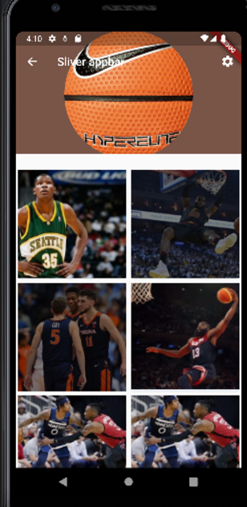

# Sliver scroll

- lib/prac2

```dart
import 'package:flutter/material.dart';
import 'package:prac2/scroll_effect.dart';

class prac2 extends StatelessWidget {

  @override
  Widget build(BuildContext context) {
    return MaterialApp(
      theme: ThemeData(
        primaryColor: Colors.brown[500]
      ),
      home: ScrollEffect(),
    );
  }
}

```

- lib/scroll_effect

```dart
import 'package:flutter/material.dart';
import 'package:prac2/image_widget.dart';

class ScrollEffect extends StatelessWidget {
  const ScrollEffect({super.key});

  @override
  Widget build(BuildContext context) {
    return Scaffold (
      body : CustomScrollView(
        slivers: [
          SliverAppBar(
            title: Text('Sliver appbar'),
            backgroundColor: Colors.brown[500],
            expandedHeight: 200,
            leading: Icon(Icons.arrow_back),
            actions: [
              Icon(Icons.settings),
              SizedBox(
                width: 12,
              ),
            ],
            flexibleSpace: FlexibleSpaceBar(
              background: CircleAvatar(
                backgroundImage: AssetImage(
                    'assets/ball.png'
                ),
                radius: 10.0,
              ),
              // background: Image.asset(
              //     'assets/ball.png',
              //     fit: BoxFit.contain,
              //     ),
            ),
          ),
          SliverToBoxAdapter(
            child: GridView.builder(
                gridDelegate: SliverGridDelegateWithFixedCrossAxisCount(
                    crossAxisCount: 2,
            ),
                itemCount: 8,
                primary: false,
                shrinkWrap: true,
                itemBuilder: (context, index){
                  return ImageWidget(index: index,);
                }),
          )
        ],
      ),
    );
  }
}

```

- lib/image_widget

```dart
import 'package:flutter/material.dart';

class ImageWidget extends StatelessWidget {
  const ImageWidget({super.key, required this.index});
  final int index;

  @override
  Widget build(BuildContext context) {
    return SizedBox(
      height: 150,
      width: double.infinity,
      child: Card(
        child : Image.asset('assets/img_$index.png',
        fit: BoxFit.cover,),
      ),
    );
  }
}

```
