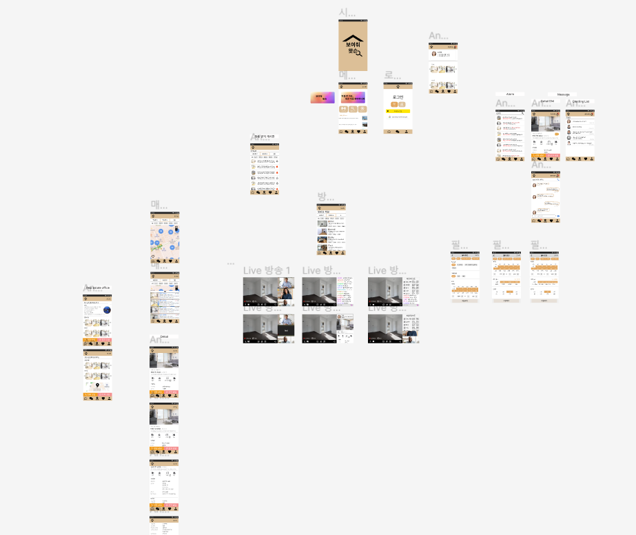
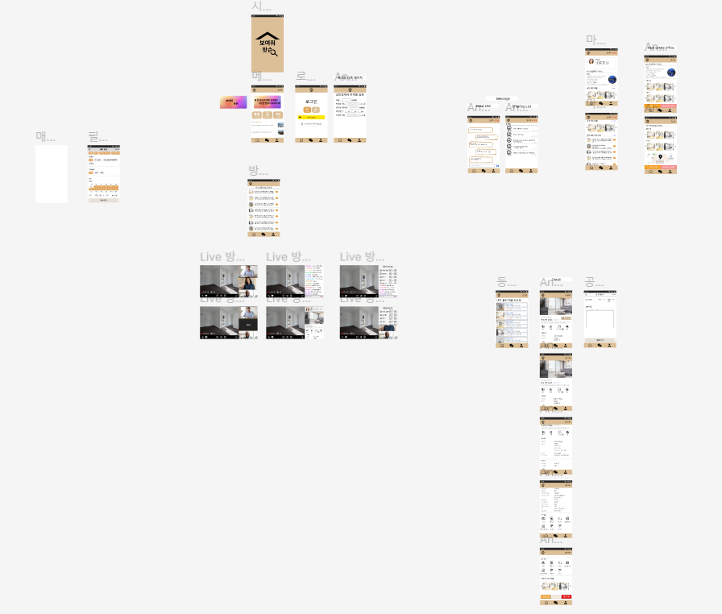

# Week2 week3

- week2
    - main color 없이 초안1로 제작
    - 올라간 사진들은 week2에 제작한 이미지
- week3
    - main color를 잡고 수정 작업 및 figma 제작 완료
    - flutter 학습
    - Flutter로 mvp 기능 구현 작업
    - Flutter MVP 제작

## Figma MVP 초안 완료

- 일반 유저
    
- 중개사 
    

- Temp
- Like
    - revised(myPage부분도 함께)
- MyPage
    - user
    - agent
- Live Page
- Map
- Index
- SignUp
    - social login
- SignIn(우선적 회원가입 위주)
    - social login
- Licenses
- Details
    - 매물 상세 페이지
    - 전화 연결
    - DM 하기
    - 거래정보
    - 방 정보
    - 추가 옵션
- payment
- Carousel 
- Details
    - 기본페이지
    - 전화, 메세지 연결하기
    - 구매 정보
    - 방 정보
    - 추가 옵션
- Chatting
- DM
- 알림창
- 공인중개사 사무소 페이지
    - 공인중개사 등록 매물 페이지
- 게시판
    - user 매물 사진 포함
    - user 매물 사진 포함 알림포함
    - 중개사가 사용하는 일반적 게시판 형식

## how to pay
결제창 진행을 하기 위해

네이버 페이와 카카오페이로 결제하기

- 카카오 : https://developers.kakao.com/docs/latest/ko/kakaopay/common 

- 네이버 : https://developer.pay.naver.com/docs/v1/api  

## Flutter MVP 기능 구현 및 제작
- carousel slider
- tabbar
- sliverlist
- get data 
    - image list
    - resoure list
    - http list
- routes
- toast message
- responsive scroll
    - chatting in the meeting

