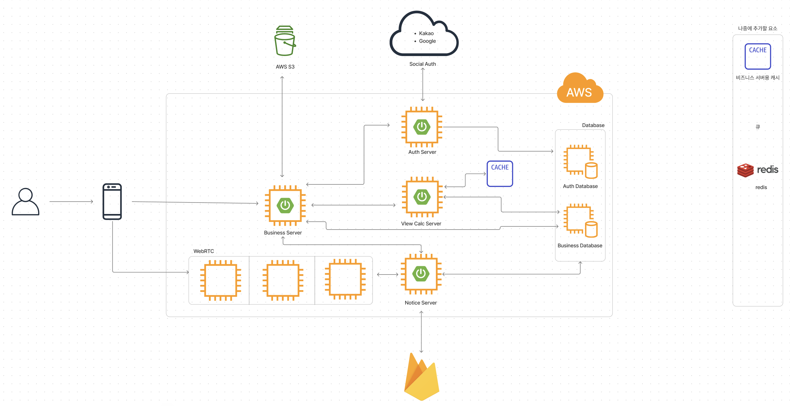

 

## **프로젝트 회의**

 

### **Backend : 아키텍처 설계 및 기능명세서/api 명세서 작성**

 

- 아키텍처
    
    
    
- [기능명세서, api 명세서](https://docs.google.com/spreadsheets/d/1O8tJik-yb2d7x9Nqm7bvH7MYdZcXFeiq4Sb5f2xZhYU/edit?pli=1#gid=0)

 
 

### **개인 역할**

 

- 회의록 작성
    - [아키텍처 설계](https://ssafy.atlassian.net/browse/S09P12A803-79)
    - [기능 명세서](https://ssafy.atlassian.net/browse/S09P12A803-2)
    - [api 명세서](https://ssafy.atlassian.net/browse/S09P12A803-81)
- 데일리 스크럼 문서 관리
    - [Week2](https://ssafy.atlassian.net/browse/S09P12A803-5)
    - [Week3](https://ssafy.atlassian.net/browse/S09P12A803-84)

 
 

## **개인 공부**

 

| 주제 및 url | 요약 |
| --- | --- |
| [OIDC](https://www.notion.so/db5afd2cac7f474b90c772aaba416dc7?pvs=21) | OIDC 기본 개념 공부 |
| [Lombok Annotation](https://www.notion.so/bfe2f596c98549d297b2ec2724c5723d?pvs=21) | SpringBoot 프로젝트에 Lombok 적용을 위해 어노테이션 공부 |
| [JPA 값 타입](https://www.notion.so/270904e8c05f46d580a38d2933183ab7?pvs=21) | 프로젝트에 JPA 사용하기 위해 강의 수강 중 |

 
